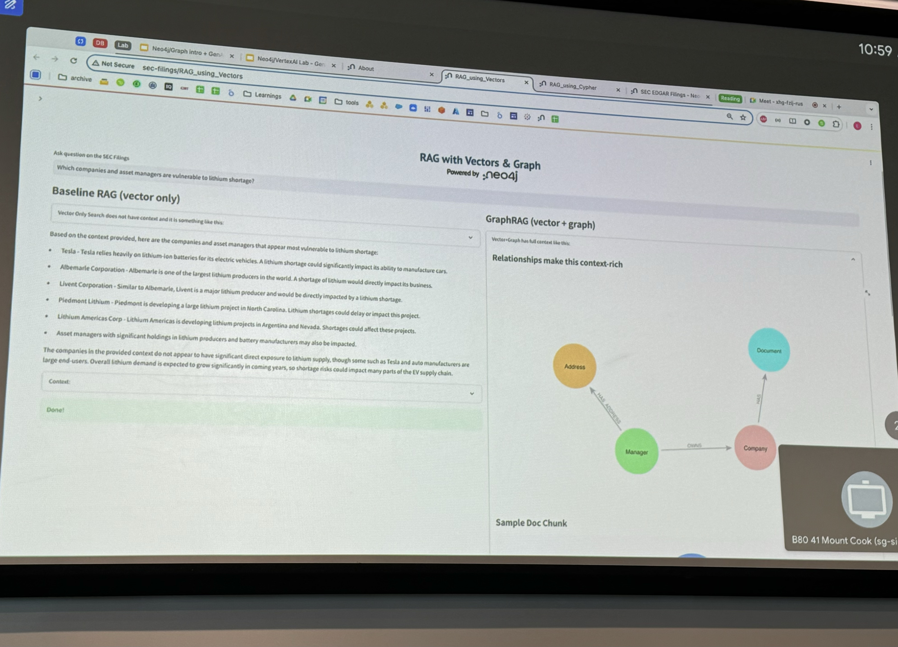

# Workshop Information

https://go.neo4j.com/LE240912Neo4jandGCPGenerativeAIWorkshop-BFSI-SIN_Registration.html

- Objective
  - **Building Responsible AI-Driven Applications: Neo4j and GCP Generative AI Workshop**
- Scope
  - The fundamentals of Knowledge Graphs and Graph Data Science
  - How to deploy Knowledge Graphs and Graph Data Science on GCP, and integrations with Vertex AI
  - How to swiftly build Generative AI apps powered by Neo4j and Vertex AI

# Introduction

_By: Siddharth Bhargava, Data Analytics Sales Specialist, Google Cloud_

- Google Data Platform: BigQuery
  - Has live source of truth, very useful to accommodate different stakeholders: Engineers, Analysts, Sales,…
  - Allows E2E, including data governance
- Remember that AI is not just about generative, but predictive as well
- Challenges of GAI
  - Lack of enterprise domain knowledge
  - Inability to verify answers
  - Confabulations
  - Data governance
  - Ethical and data bias concerns

# GraphDB

_By: Ezhil Vendhan, Senior Cloud Partner Architect, Neo4j | Xavier Pilas, Sr. Solutions Architect, Neo4j_

1. RAG with Neo4j

   1. Neo4j uses Apache Lucene under the hood, which is the same as ES and most other VectorDBs (Hence able to also perform full-text search solely)

   2. Neo4j is able to unify various retrieval methods:

      1. Vector & Text
         1. Find similar documents and content
         2. This will perform quite the same as typical vectorDBs because under the hood still does ANN / KNN
            
      2. Knowledge graph
         1. Identify entities associated to content and patterns in the connected data
      3. Data science
         1. Improve GenAI through identifying hidden relationships and discovering insights
            

2. Quick comparison of the different retrieval methods
   
3. There are **different ways to perform GraphRAG**, and it is important to be able to identify which types of questions should be routed to what method / hybrid approach

   1. The example given demonstrated a clear query with conjunctions (e.g., “Which companies and asset managers are vulnerable to lithium storage?”). I asked whether such queries need to be well-crafted or if query rewriting is necessary

      1. The speaker explained that while crafting precise queries is one approach, another method is to perform RAG directly via Cypher, which can handle less structured queries more effectively
         

   2. **M1: RAG via Semantic Layers, M2: RAG via Cypher**

4. GraphRAG would be a lot more optimized compared to vector search because:
   1. M1: RAG via semantic layers
      1. Global search starts at the first node, followed by localized searches in neighboring nodes (subset of the graph)
   2. M2: RAG via cypher
      1. Eliminates the need for data embedding, saving time and storage
5. There’s really no magic to not spend effort to create the graph based on supported use cases (types of questions), and expect good results
   - Directly asking LLMs to create a graph is often impractical due to free-form data and potential inaccuracies
   - It's beneficial to first transform unstructured data into structured data before graph creation
   - There is always a need to have a rather fixed ontology. Need to know your use cases, the type of questions that your data can work (to design the graphDB in a certain manner / to be able to include as part of function calling)
     - Without this ontology / human intervention on verifying the graph, would you be able to trust the responses?
6. Higher accuracy through GraphRAG
   1. Especially on the use cases of multi-step, domain-specific and high connectivity questions where LLM tends to be prone to hallucinations due to the lack of context from failure to capture connections across nuanced facts
   2. Better grounding / explainability through GraphRAG (able to perform multi-hop)
   3. Cited MOE example again, where vector search achieves ~70% accuracy while using graph that was set up within weeks, achieved ~85% accuracy
   4. [https://data.world/blog/generative-ai-benchmark-increasing-the-accuracy-of-llms-in-the-enterprise-with-a-knowledge-graph](https://data.world/blog/generative-ai-benchmark-increasing-the-accuracy-of-llms-in-the-enterprise-with-a-knowledge-graph/)
7. Evaluation of constructed graph
   1. Ask LLM to create synthetic questions & answers based on a small subset of data
      1. Foundation models good for synthetic generation as well
   2. Create graph, run the same questions on the constructed graph
8. Neo4j Bloom
   - User-friendly interface for visual navigation of graph data, suitable for demos
   - E.g.: “Saved Cypher” where cypher queries are crafted and abstracted on the UI as natural queries
9. GCP BigQuery

   - Even though GCP Big Query supports direct graph retrieval uses, it’s advised to still ingest into AuraDB / AuraDS as it would be more performant especially when running GDS
     - GDS however will still be running in heap
       

10. Free courses on Neo4j / Graph
    - https://graphacademy.neo4j.com/categories/
11. 4 key success factors for enterprise AI
    1. Do you have a single, integrated platform that provides your teams optionality and choice?
    2. Can you differentiate with your knowledge and data?
    3. Does your AI platform future proof your AI investment with innovation at every later?
    4. Is your AI enterprise ready so you can go to production with confidence?
12. Additional capabilities / enhancement with graph
    - **Citations can also easily be included in responses from GraphRAG**
      - Example: see chatbot in https://neo4j.com/labs/genai-ecosystem/llm-graph-builder/
        - Implementation: https://github.com/neo4j-labs/llm-graph-builder
      - Store documentID as part of the metadata in the node and use prompt to ask LLM to return the citations. It will be relatively accurate because of the use of cypher language
    - **Deduplication of entity - also an important step for better graph structural integrity**
      - Example: https://github.com/tomasonjo/blogs/blob/master/llm/llama_index_neo4j_custom_retriever.ipynb
        - Not LLM / GDS approach
        - But will need to re-generate when new data comes in

# Lab: GraphRAG

## Creating of GraphDB

- Parsing data from unstructured text (pdfs)
- Steps:
  - Extract different entities (e.g.: person, address, product) through LLM
    - Providing definition for each entity
    - Providing how to locate these entities
      - Input text has a format akin to XML (delimited, and fixed spacing formatting)
    - My thoughts: But I think given such a structured format, no need to use LLM to help to extract - expensive, and possible errors → still require validation
  - Should create node key constraints before ingestion (on the contrary from typical constraints in traditional relational databases where constraints are created after data is ingested)
    - This acts as a unique id and an index, which in this case benefits a lot from the `MERGE` operation as part of the graph creation
- Controlling everything using schema driven approach (e.g.: entity extraction)

## GraphRAG example: Chatbot

### Method 1: Text to Cypher

- Steps:
  - Craft cypher generation prompt template
    - Can see example: [https://github.com/lQingRu/workshop-neo4j-and-vertex-ai/blob/main/Lab 6 - Chatbot/chatbot.ipynb](https://github.com/lQingRu/workshop-neo4j-and-vertex-ai/blob/main/Lab%206%20-%20Chatbot/chatbot.ipynb)
    - Few shot prompting esp. for models that may not perform so well in cypher
      - But most models, even foundation models can do quite well
      - Gemini-Fast was used in the demo and it was quite decent
    - Include graph schema
      - For neo4j, it can simply be obtained through `schema` after connecting to neo4j through `langchain_community.graphs.Neo4jGraph`
  - Execute and obtain graph results based off the query
    - Used `langchain.chains.GraphCypherQAChain.from_llm` which does the
  - Pass the graph results and execute a follow-up task via LLM to summarize and answer to the query
    - To include the answering of questions with the returned results from the cypher query

### Method 2: Via Semantic layers

- The speaker didn’t go through this part, but some useful resources I found under the same repo:
  - https://github.com/neo4j-partners/neo4j-generative-ai-google-cloud/blob/main/assetmanager/ui/streamlit/semantic_layer/semantic_fn.py
  - https://github.com/neo4j-partners/neo4j-generative-ai-google-cloud/blob/main/assetmanager/ui/streamlit/rag_semantic_layer.py
- Basically, queries directed to the different cypher queries via tool calling of LLMs where tools are specific functionalities that can be derived from written cypher queries (e.g.: get shortest path between 2 companies)
  - This means no cypher queries gets generated by LLM. Which curbs the part on how the first method may result in brittleness

# Others

- Free courses on Neo4j / Graph: https://graphacademy.neo4j.com/categories/
  
  
  
  
